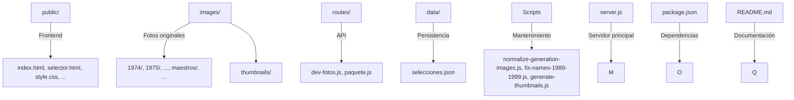
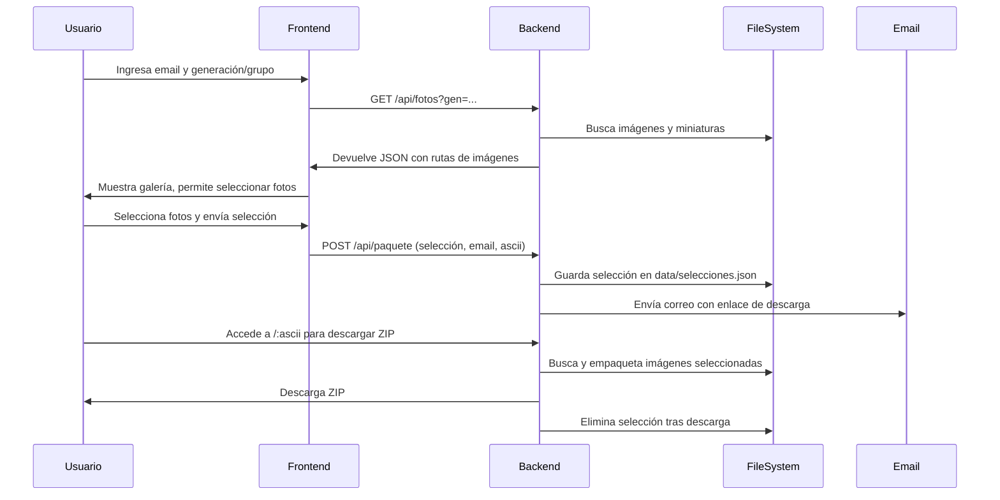
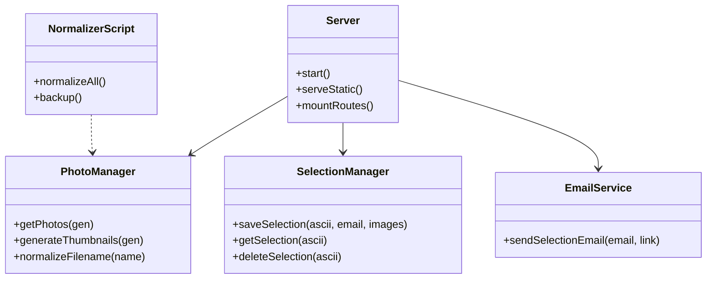

# Pinakothek CSM – Sistema de Gestión y Descarga de Fotos de Generaciones

## Tabla de Contenidos
1. [Visión General](#visión-general)
2. [Arquitectura y Organización de Carpetas](#arquitectura-y-organización-de-carpetas)
3. [Flujo de Usuario y Lógica General](#flujo-de-usuario-y-lógica-general)
4. [Diagrama de Clases y Estructura de Código](#diagrama-de-clases-y-estructura-de-código)
5. [Frontend: Estructura, Lógica y Funciones](#frontend-estructura-lógica-y-funciones)
6. [Backend: API, Rutas, Funciones y Procesos](#backend-api-rutas-funciones-y-procesos)
7. [Normalización y Scripts de Mantenimiento](#normalización-y-scripts-de-mantenimiento)
8. [Persistencia y Seguridad](#persistencia-y-seguridad)
9. [Internacionalización y Accesibilidad](#internacionalización-y-accesibilidad)
10. [Despliegue y Buenas Prácticas](#despliegue-y-buenas-prácticas)
11. [Preguntas Frecuentes y Troubleshooting](#preguntas-frecuentes-y-troubleshooting)
12. [Créditos y Licencia](#créditos-y-licencia)

---

## Visión General
Pinakothek CSM es una plataforma web para la gestión, visualización y descarga de fotos históricas de generaciones escolares y grupos especiales del Colegio Suizo de México. Permite a exalumnos, personal y comunidad seleccionar y descargar imágenes de alta calidad, con una experiencia moderna, responsiva y multilingüe.

---

## Arquitectura y Organización de Carpetas



**Estructura de carpetas:**
```
.
├── images/                  # Fotos originales y miniaturas por generación y grupo
│   ├── 1989/, 1990/, ...    # Carpetas por año de generación
│   ├── maestros/, ...       # Carpetas de grupos especiales
│   └── thumbnails/          # Miniaturas generadas automáticamente
├── public/                  # Frontend estático (HTML, CSS, JS, assets)
├── routes/                  # Rutas de la API backend (Express)
├── data/                    # Persistencia de selecciones de usuario
├── fix-names-1989-1999.js   # Script de normalización especial
├── normalize-generation-images.js # Script general de normalización
├── generate-thumbnails.js   # Script para miniaturas
├── server.js                # Servidor principal Express
├── package.json             # Dependencias y scripts npm
├── README.md                # Documentación
└── ...                      # Otros archivos (backups, logs, etc.)
```

---

## Flujo de Usuario y Lógica General



---

## Diagrama de Clases y Estructura de Código



**Explicación:**
- **Server**: Inicia el servidor, sirve archivos estáticos y monta rutas de la API.
- **PhotoManager**: Lógica para obtener fotos, generar miniaturas y normalizar nombres.
- **SelectionManager**: Guarda, recupera y elimina selecciones de usuario.
- **EmailService**: Envía correos con enlaces de descarga.
- **NormalizerScript**: Scripts para normalizar y respaldar nombres de archivos.

---

## Frontend: Estructura, Lógica y Funciones

### index.html
- Formulario para email y generación/grupo especial.
- Selector de idioma (es, en, de, fr).
- Validación de campos y UX amigable.
- Al enviar, abre `selector.html` con los parámetros.

### selector.html
- Obtiene generación/grupo de la URL.
- Llama a `/api/fotos?gen=...` para obtener la galería.
- Permite seleccionar imágenes (toggle visual).
- Al hacer clic en "Descargar selección", envía la selección a `/api/paquete` junto con el email y un código ascii único.
- Muestra alertas de éxito/error.

### main.js
- Dibuja y anima cruces suizas en el fondo usando canvas.
- Responsivo a tamaño de ventana.

#### Funciones clave del frontend
- **aplicarTraduccion(idioma)**: Cambia todos los textos y placeholders al idioma seleccionado.
- **mostrarCampo()**: Muestra u oculta campos del formulario según la selección.
- **enviarSeleccion()**: Envía la selección de imágenes al backend.
- **cleanPhotoName(name)**: Limpia y muestra nombres de fotos de forma legible.

---

## Backend: API, Rutas, Funciones y Procesos

### server.js
- Configura Express, sirve estáticos y monta rutas.
- Expone `/api/fotos` y `/api/paquete`.
- Expone `/:ascii` para descargar ZIP de la selección.
- Lógica robusta para encontrar la carpeta correcta de cada foto (por generación o grupo especial).
- Elimina la selección tras descargar el ZIP.

#### Funciones clave del backend
- **obtenerCarpeta(nombre)**: Determina la carpeta correcta para una foto según su nombre normalizado.
- **ZIP Download**: Busca la selección guardada, localiza los archivos y genera un ZIP para descargar.

### routes/dev-fotos.js
- GET `/api/fotos?gen=...`
- Busca imágenes en la carpeta correspondiente.
- Genera miniaturas si faltan (con `sharp`).
- Devuelve JSON con rutas de miniatura y original.

#### Funciones clave
- **normalizeDirName(name)**: Normaliza el nombre de la generación/grupo para búsqueda.
- **generateThumbnails(gen)**: Genera miniaturas si no existen.

### routes/paquete.js
- POST `/api/paquete`
- Valida email y datos.
- Normaliza nombres de archivos seleccionados.
- Guarda la selección en `data/selecciones.json`.
- Envía correo con el enlace de descarga usando Gmail/Nodemailer.
- Maneja errores de forma detallada.

#### Funciones clave
- **saveSelection(ascii, email, images)**: Guarda la selección del usuario.
- **sendSelectionEmail(email, link)**: Envía el correo con el enlace de descarga.

---

## Normalización y Scripts de Mantenimiento

### normalize-generation-images.js
- Renombra todas las fotos de cada generación a un formato estándar: `NN_GRUPO_AÑO_GGEN.ext`
- Extrae y normaliza grado, sección, año, generación.
- Asigna números continuos por orden de grado.
- Crea backup antes de modificar.

#### Funciones clave
- **removeAccents(s)**: Elimina acentos de los nombres.
- **gradeMap/gradeOrder**: Mapeo y orden de grados para normalización.
- **backup()**: Crea respaldo antes de renombrar.

### fix-names-1989-1999.js
- Corrige casos especiales para generaciones 1989–1999:
  - Infere años faltantes (`__`).
  - Renumera grupos repetidos (P1, S1, C1).
  - Elimina el `1` después de `PP`.
- Crea backup antes de modificar.

#### Funciones clave
- **Renumeración de grupos**: Asigna números continuos a grupos repetidos.
- **Inferencia de año**: Deduce el año si está ausente.

### generate-thumbnails.js
- Genera miniaturas de 300px de ancho para todas las imágenes originales.

#### Funciones clave
- **generarMiniaturas()**: Recorre todas las imágenes y genera miniaturas si no existen.

---

## Persistencia y Seguridad
- Las selecciones de los usuarios se guardan en `data/selecciones.json` usando un código ascii único.
- Cuando el usuario accede a su enlace, el backend genera un ZIP con las fotos seleccionadas y elimina la selección para privacidad.
- El backend valida y normaliza todos los datos recibidos.
- Manejo robusto de errores y logs para auditoría.

---

## Internacionalización y Accesibilidad
- Interfaz multilingüe (español, inglés, alemán, francés).
- Traducción de textos y placeholders en tiempo real.
- Estilos y componentes accesibles y responsivos.
- Navegación y selección amigable para usuarios de todas las edades.

---

## Despliegue y Buenas Prácticas

### Instalación
```bash
git clone https://github.com/cgzdev/WebPage
cd WebPage
npm install
node server.js
```

### Recomendaciones
- No subas `images/`, `node_modules/` ni `.env` a Git.
- Haz backups antes de correr scripts de normalización.
- Usa siempre nombres de archivos normalizados.
- Si agregas nuevas generaciones, crea la carpeta y coloca las fotos originales.
- No borres la carpeta `thumbnails/` si ya se generó.

---

## SSL con Nginx y Let's Encrypt

Este proyecto incluye configuración de Nginx como proxy inverso para el servidor Node (puerto 3000) y scripts para instalar Certbot y habilitar SSL automático.

### Archivos
- `deploy/nginx-webpage.conf`: sitio Nginx para `pinakothek60aniv.csm.edu.mx`.
- `deploy/setup-ssl.sh`: instala Nginx/Certbot, configura el sitio y obtiene el certificado.
- `deploy/renew-ssl.sh`: renueva certificados y recarga Nginx.

### Pasos (en el servidor)
1. Apunta el DNS del dominio a este servidor (registro A/AAAA).
2. Asegúrate de que el servidor Node escuche en `127.0.0.1:3000` y esté activo (PM2 recomendado).
3. Ejecuta como root:

```bash
bash /root/WebPage/deploy/setup-ssl.sh
```

Esto instalará Nginx y Certbot, configurará el sitio, obtendrá el certificado y activará la renovación automática.

### Renovación manual (opcional)

```bash
bash /root/WebPage/deploy/renew-ssl.sh
```

Certbot ya programa renovaciones automáticas; el script recarga Nginx tras renovar.

---

## Preguntas Frecuentes y Troubleshooting

- **No se ven las imágenes:**  
  - Verifica que las imágenes sean válidas y pesen más de 1KB.
  - Verifica que el parámetro `gen` coincida con el nombre de la carpeta.
  - Usa `npm install` si el proyecto no levanta por falta de dependencias.

- **ZIP vacío o incompleto:**  
  - Asegúrate de que los nombres de archivos estén normalizados.
  - Verifica la lógica de extracción de carpeta en el backend.

- **Error al enviar correo:**  
  - Revisa las credenciales de Gmail en `.env`.
  - Consulta los logs del servidor para detalles.

---

## Créditos y Licencia
- Desarrollado por cgzdev y colaboradores.
- Licencia MIT.
- Inspirado en la historia y comunidad del Colegio Suizo de México.
