# Photo Selection Application - Workflow & Flowchart

## Workflow Chart

## Linear Flowchart (Top Right to Bottom Left)

```mermaid
graph LR
    %% Top Row - Initial Entry
    A1[📧 Enter Email] --> A2[📋 Select Field Type]
    A2 --> A3[📝 Input Generation/Group]
    
    %% Second Row - Validation & Navigation
    B1[✅ Validate Input] --> B2[🚪 Open Photo Selector]
    B2 --> B3[📱 Load Photo Gallery]
    
    %% Third Row - Photo Selection Interface
    C1[🖼️ Display Photos] --> C2[👆 User Interactions]
    C2 --> C3[📊 Update Counter]
    
    %% Fourth Row - Action Buttons
    D1[🔄 Select All Toggle] --> D2[📤 Send Selection]
    D2 --> D3[⬅️ Back Navigation]
    
    %% Fifth Row - Processing & Results
    E1[⚙️ Process Selection] --> E2[📧 Send to Server]
    E2 --> E3[✅ Success Message]
    
    %% Bottom Row - Completion
    F1[🏁 End Process] --> F2[🔄 Return to Start]
    F2 --> F3[📱 Close Window]
    
    %% Vertical Connections
    A3 --> B1
    B3 --> C1
    C3 --> D1
    D3 --> E1
    E3 --> F1
    
    style A1 fill:#e3f2fd
    style B2 fill:#e8f5e8
    style C1 fill:#fff8e1
    style D2 fill:#f3e5f5
    style E3 fill:#e8f5e8
    style F3 fill:#ffebee
```

## Detailed User Flow Description

### 1. **Entry Point (Main Page)**
- **Email Input**: User enters their email address
- **Field Selection**: Choose between "Generación" or "Personal y extraordinarios"
- **Input Validation**: 
  - Generation: Accepts formats (2027, 27, g27, g2027)
  - Group: Dropdown selection (Maestros, Administración, etc.)

### 2. **Navigation & Validation**
- **Format Parsing**: System converts input to standard format
- **Error Handling**: Invalid inputs show error messages
- **Page Transition**: Opens photo selector in new tab/window

### 3. **Photo Selection Interface**
- **Header Display**: Shows generation/group title
- **Gallery Loading**: Fetches and displays photos from server
- **Counter Display**: Shows selected photo count in top-right

### 4. **User Interactions**
- **Photo Selection**: Click to select/deselect individual photos
- **Bulk Actions**: "Select All" button toggles all photos
- **Visual Feedback**: Selected photos get grey overlay and scale down
- **Real-time Counter**: Updates immediately with selection changes

### 5. **Action Buttons**
- **Header Buttons**: "Seleccionar todas" and "Enviar" in top menu
- **Floating Buttons**: Appear when scrolling (bottom-right corner)
- **Back Button**: Circular button in bottom-left corner

### 6. **Processing & Submission**
- **Validation**: Ensures at least one photo is selected
- **Data Preparation**: Formats selection for server
- **API Call**: Sends selection to backend
- **Response Handling**: Shows success/error messages

### 7. **Completion & Navigation**
- **Success Feedback**: Confirmation message displayed
- **Return Options**: Back button or browser navigation
- **Process End**: User can close window or return to main page

## Key Features Highlighted

### **Generation Input Flexibility**
- Multiple format support (YYYY, XX, gXX, gYYYY)
- Smart parsing and validation
- Error handling with helpful messages

### **Dual Interface Design**
- Header buttons for immediate access
- Floating buttons for scroll-based access
- Consistent functionality across both interfaces

### **Visual Feedback System**
- Real-time photo counter
- Selected photo styling (grey overlay, scaling)
- Smooth animations and transitions

### **Responsive Design**
- Mobile-optimized layout
- Adaptive button positioning
- Touch-friendly interactions

### **Error Handling**
- Input validation with clear messages
- Network error handling
- Graceful fallbacks for missing data
